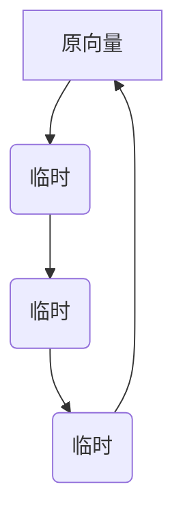
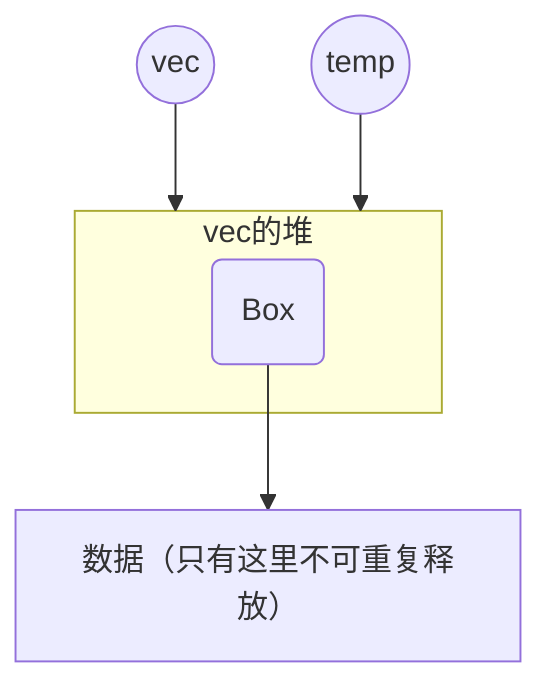

上一章结尾提到，反复复制还有优化空间，可以优化成环状的。
在递推到最小单位的数组后，每次回归都是归并到更大的临时向量，最终回归到原来的向量。
而在叶子节点，需要获得原来向量对应位置的数据，所以整个算法的拷贝流程是这样的



分析这些需求，可以简单定义一下接口是怎样的：

首先，排序函数依然是对原向量的修改，所以递归函数必须有`vec: &mut Vec<T>`这个参数。

大概是这样
```rust
merge_sort(vec, compare, 0, vec.len());
```

那么对于递归调用，代入的则应该是一个新建的临时空间：
```rust
let left = Vec::with_capacity(q - p);
merge_sort(left, compare, p, q);
let right = Vec::with_capacity(r - q);
merge_sort(right, compare, q, r);
```

合并，就是直接将存放结果的区域和临时向量作为参数，临时向量之后就没用了，所以可以吃掉。

```rust
merge(vec, compare, left, right);
```

但是到了终止条件，待排序的数组都是只有一个元素了，这个元素从哪来？因为原来的数组在第一个递归函数就弄丢了，
所以为了在叶子节点能索引到原来函数的数据，需要不断传进去，把递归函数整成这样。

```rust
merge_sort(vec, original_vec, compare, 0, vec.len());
```

最后得到这样的代码：

```rust
pub struct MergeSorter<'a, Seq>(pub &'a mut Seq);

impl<'a, Elem> Sorter for MergeSorter<'a, Vec<Elem>> {
    type Element = Elem;

    fn sort_by(&mut self, compare: fn(prev: &Self::Element, next: &Self::Element) -> bool) {
        let vec = &mut self.0;

        if vec.len() < 2 {
            return;
        }

        unsafe {
            // 创建了一个指向了原数组空间的数组，但元素是ManuallyDrop包裹
            // 使得递归的数组拷贝类型是对齐的，第一层递归不和后来的递归搞特殊
            let p = vec.as_mut_ptr().cast::<ManuallyDrop<Elem>>();
            let len = vec.len();
            let cap = vec.capacity();
            let mut temp = Vec::from_raw_parts(p, len, cap);
            merge_sort(&mut temp, vec, compare, 0, vec.len());
            // 用了同一个堆空间，要避免重复释放
            forget(temp);
        }
    }
}

fn merge_sort<T>(
    temp: &mut Vec<ManuallyDrop<T>>,
    // 代入原数组只是用于叶子节点拷贝，不需要可变
    vec: &Vec<T>,
    compare: fn(prev: &T, next: &T) -> bool,
    p: usize,
    r: usize
) {
    if p < r - 1 {
        let q = (p + 1 + r) >> 1;
        unsafe {
            let mut left = Vec::<ManuallyDrop<T>>::with_capacity(q - p);
            // set_len()比创建Layer方便，只不过之前没发现...
            left.set_len(q - p);
            merge_sort(&mut left, vec, compare, p, q);

            let mut right = Vec::<ManuallyDrop<T>>::with_capacity(r - q);
            right.set_len(r - q);
            merge_sort(&mut right, vec, compare, q, r);
            merge(temp, compare, left, right);
        }
    } else {
        // 叶子，终止
        unsafe {
            ptr::copy((&vec[p] as *const T).cast::<ManuallyDrop<T>>(), &mut temp[0], 1);
        }
    }
}

fn merge<T>(
    temp: &mut Vec<ManuallyDrop<T>>,
    compare: fn(prev: &T, next: &T) -> bool,
    left: Vec<ManuallyDrop<T>>,
    right: Vec<ManuallyDrop<T>>
) {
    let left_length = left.len();
    let right_length = right.len();
    let mut i = 0;
    let mut j = 0;
    let mut k = 0;

    unsafe {
        while i < left_length && j < right_length {
            if compare(&left[i], &right[j]) {
                ptr::copy(&left[i], &mut temp[k], 1);
                i += 1;
            } else {
                ptr::copy(&right[j], &mut temp[k], 1);
                j += 1;
            }
            k += 1;
        }

        if i < left_length {
            ptr::copy(&left[i], &mut temp[k], left_length - i);
        } else if j < right_length {
            ptr::copy(&right[j], &mut temp[k], right_length - j);
        }
    }
}
```

----

注意temp和vec的关系是这样的，两个数组对着同一个堆空间开了数组，共用资源，这个前面的不一样：

