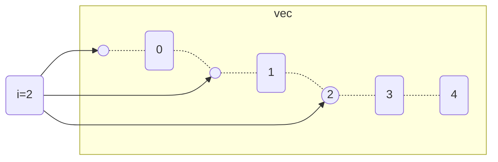

前面已经介绍了插入排序和归并排序以及实现，这都是书上教的，书本已经证明了算法的正确性。
但当我们需要自己发明一个算法或者做习题的时候，得自己想方法，还得证明方法的正确性。
运算的规模是个变量，证明算法正确性，本身就需要递归的方式，用数学归纳法或者强归纳法去证明。

## 证明算法的正确性

数学归纳法就是对于一系列命题$p_1, p_2, ... , p_n$，当$p_1$为真，且$p_i \rightarrow p_{i+1}$也为真时，
$p_1, p_2, ... , p_n$都为真。

那么在一个排序算法里，n就是数组的规模。而且在插入排序中，每一次从未排序区取出元素vec\[i\]，插入已排序的数组vec\[0..i\]，
就隐含了“vec\[0..i\]已排序”这个前提，这个命题在每次插入前都为真。

将每次插入视为每轮循环，每轮循环前都为真的一个命题，叫做**循环不变式**。按照这个定义，循环不变式可以有无限多个，
比如“太阳从东边升起”都算。但在这里，能用来证明算法正确性的循环不变式才是有意义的。

用数学的逻辑表达式表达“vec\[0..i\]已排序”，应该写成：
$$
p_i: \forall_a\forall_b((a<b<i) \rightarrow ({vec}_a<{vec}_b))
$$

（假设这个是升序的）

然后，取出vec\[i\]，沿着数组*从右往左*依次比较，直到找到符合排序函数（a < b）的*相邻对*，终止循环并插入。
这个过程是一个**顺序查找**。
可以证明如果待插入的数组是已排序的，那么插入后的数组也是已排序的，$p_i \rightarrow p_{i+1}$为真。

现在还需要证明初始条件为真：当i为1时，待插入数组没有元素，当i为2时，待插入数组只有1个元素，我们直接将$p_1, p_2$定义为真。
（姑且把这当成一个公理）

所以，算法的正确性得证。

前面提到了将vec\[i\]取出，对左边的数组查询并插入的过程是一个**顺序查找**的过程，在最坏的情形下，这个过程需要i的时间。
整个算法需要的时间是一个等差数列的前n项和，时间复杂度是$O(n^2)$的，显然这还有优化空间。

## 幸运52

20年前央视2套有个节目叫《幸运52》，李咏主持的。里面有个猜价格比赛，选手需要猜一个呈上来的商品的价格，李咏会根据价格回答
“高了”、“低了”以及“正确”。游戏是限时计分的，比的是限时内猜对的次数，当然是要越快越好。

如何更快猜中，就是一个查询算法的问题。价格可以视为是一组排序好的整数，聪明的方法当然不是估计一个价，然后一块一块地靠近目标。

> “500！”
> “高了！”
> “499！”
> “高了！”
> “498！”
> “高了！”
> ...

很多选手已经学会先猜百位，相邻两个百位之间一个高了一个低了，就可以确定百位是什么数了。

> “500！”
> “高了！”
> “400！”
> “高了！”
> “300！”
> “低了！”
> “350！”
> “高了！”
> ...

按照位数递进，如果400还是高了，为什么不直接喊300呢？实际上跨度也是可以自定义的，因为进制都是人的习惯。
人习惯十进制，而二进制比十进制还快，因为结果就只有“高了”、“低了”、“正确”三种。

而在插入排序中，比较函数只会返回布尔值，结果就只有“对了”、“没对”两种结果。所以，每次比较的跨度，直接取中点更快。
用猜价格类比就是：

> “500！”
> “高了！”
> “250！”
> “低了！”
> “375！”
> “高了！”
> “312！”
> “低了！”
> ...

这种查找方法就是**二分查找**。

## 二分查找

猜数字游戏，每一次猜都是在确定范围，第一次猜就是确定一个大概的价格，比如500。如果500和250都高了，
那么从500到250都不会再考虑，反过来，另一个方向也一样。每次这样的猜测都是在排除一个范围，让待选范围逐渐减少，
最终范围小到只剩一个。

看看之前的实现，顺序查找下的插入排序：

```rust
// 
pub fn sort<Elem>(vec: &mut Vec<Elem>, compare: fn(prev: &Elem, next: &Elem) -> bool) {
    for i in 1..vec.len() {
        unsafe {
            let e = ptr::read(&vec[i]);
            let mut j = i;
            while j > 0 && !compare(&vec[j - 1], &e) {
                ptr::copy(&vec[j - 1], &mut vec[j], 1);
                j = j - 1;
            }
            ptr::write(&mut vec[j], e);
        }
    }
}
```

找到之后就不再遍历下去，也是一种排除，只不过是在找到后排除。这个排除是排除的左边，那么右边也是同理。
所以应该准备两个“指针”指向左界和右界，那么左界和右界定在哪？

就我个人的感觉，学排序什么的，下标最难，总是有特殊情况，不知道该+1-1，不知道从0还是从1开始，也不知道在哪结束，
这关系到取中点是哪里为中。

不过我现在也有了些方法论了，就比如说这个问题。

首先要确定的是域的规范，应当统一标准，比如任何范围都是左开右闭区间，比如$[0, i)$。

然后，以0为第一个，和语言的习惯相符。书中给的伪代码是1开头的，要转变成0开头。如果是Lua之类的语言，数组是1开头的，
倒是方便了。开头为0或者1决定了数组的结尾下标是等于数组长度还是等于数组长度-1。

这里只要明确了这个，任何“范围”都应该如此定义。

在一次插入排序中，待排序的元素是vec\[i\]，待插入的数组是从0到i-1的i个元素组成的子数组，可供插入的空间则是i+1个。


在顺序查找中，实际上是包含了i+1次循环的，因为循环条件判定失败也算一次。
在足够次数（i+1次）的循环中，每个插入点都会被遍历到。

而在二分查找里，并不需要循环这么多次，那么定位规则是怎样的？
如果说最终确定的下标用j表示，那么j能取到的域是什么？

**答案是$[0, i]$**

那么可以先把左界和右界定下来：
```rust
for i in 1..vec.len() {
    unsafe {
        let e = ptr::read(&vec[i]);

        // 前面不变，下面开始改
        let mut left = 0;
        let mut right = i;
    }
}
```

然后取中点：
```rust
let j = (left + right) >> 1; // floor((left + right) / 2)
```

由于无符号整型计算出小数会直接截掉，所以这个计算自带一个向下取整，等价于注释里写的公式。
这个函数在一般情况下，**只要right > left，j的值永远满足$j \in [left, right)$**。

只有当$left = right$时，$j = right$。

而且要注意的是，在顺序查找插入排序里，**待插入元素永远在和左边的元素比较**。所以比较函数是：
```rust
compare(&vec[j - 1], &e)
```
这也和区间划定规则相符，right表示的地方是自己所处的位置，所以自身并不会被取到和自己比。

并且这也意味着，如果比较函数通过了，“`e`适合做`vec[j-1]`的右邻居”，插入操作就是把原`vec[j]`
以及后续元素往右移，再将`e`写入`vec[j]`。

**二分查找也适用这个规则。**

当找到一个中点元素`vec[j]`时，与待比较元素`e`作比较，如果满足，则表明顺序是符合的，
但这并不意味着找到了，只意味着“`e`只有可能在`vec[j]`右边任何一个位置”。这个命题也包含了
“`vec[j]`不是保存`e`的位置，至少得是`vec[j+1]`”。

所以为了让`vec[j]`也被排除掉，左界会被定在`j+1`的位置。

```rust
if compare(&vec[j], &e) {
    left = j + 1;
}
```

反过来，右界因为是开区间不会被取到，所以右界定在`j`的位置就能排除了。
```rust
else {
    right = j;
}
```
这个判定是非此即彼的，所以在执行每一个循环后，必有$j \notin [left, right)$，这个界是一定会缩小的。
最终会有一个`right - left == 1`的情况，根据取中点公式，这时候`j`将等于`left`，
接下来要么是`left`移动到了`right`的位置，要么`right`移动到了`left`。

最后一个循环决定的是`e`会在`vec[j]`的左边还是右边：左边，`e`取代`vec[j]`；右边，`e`取代`vec[j+1]`。

然后执行插入:

```rust
 // 注意一定要用copy，因为读区和写区重叠。如果i == left这个函数不会运行
ptr::copy(&vec[left], &mut vec[left + 1], i - left);
ptr::write(&mut vec[left], e);
```

插入排序最终写成这样：

```rust
impl<'a, Elem> Sorter for InsertionSorter<'a, Vec<Elem>> {
    type Element = Elem;

    fn sort_by(&mut self, compare: fn(prev: &Self::Element, next: &Self::Element) -> bool) {
        let vec = &mut self.0;
        let len = vec.len();

        if len < 2 {
            return;
        }

        for i in 1..vec.len() {
            unsafe {
                let e = ptr::read(&vec[i]);
                let mut left = 0;
                let mut right = i;
                while left < right {
                    let j = (left + right) >> 1; // floor((left + right) / 2)
                    if compare(&vec[j], &e) {
                        left = j + 1;
                    } else {
                        right = j;
                    }
                }
                ptr::copy(&vec[left], &mut vec[left + 1], i - left);
                ptr::write(&mut vec[left], e);
            }
        }
    }
}
```